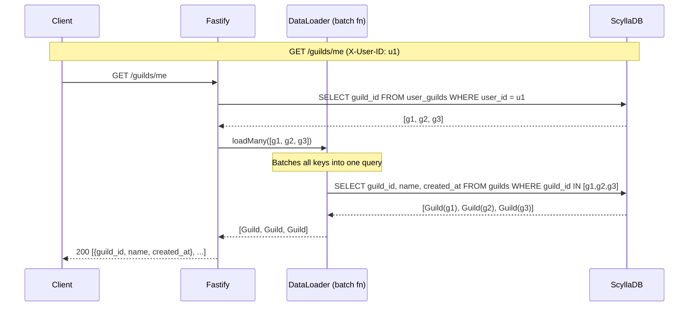
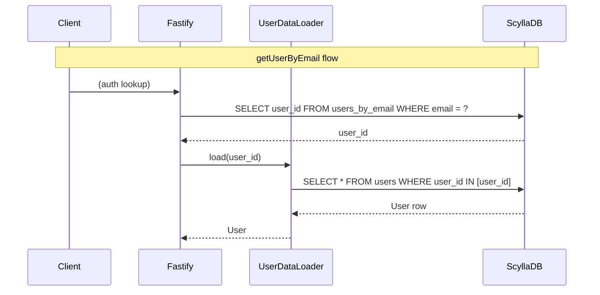
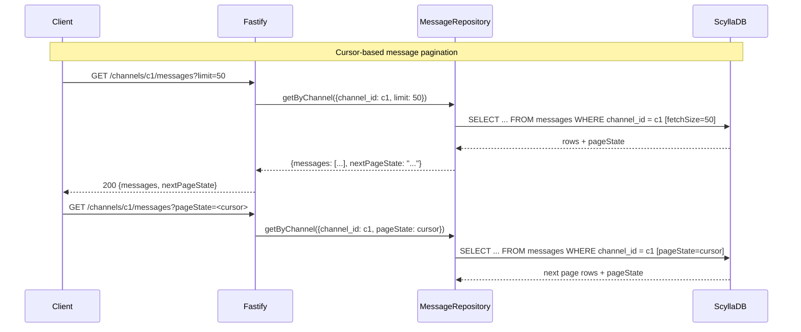

# data-service

Fastify service (port **3001**) that owns all ScyllaDB reads/writes for Jiscord. All multi-entity lookups are coalesced through DataLoader to prevent N+1 queries.

## API Surface

| Method | Path | Auth | Description |
|--------|------|------|-------------|
| GET | `/health` | — | DB liveness check. Returns `503` if no ScyllaDB hosts are connected. |
| GET | `/channels/:channelId/messages` | — | Paginated message history. Query params: `limit` (default 50, max 100), `pageState` (opaque cursor). |
| POST | `/channels/:channelId/messages` | — | Insert a message. Body: `{ author_id, content }`. Returns `201 { ok: true }`. |
| GET | `/guilds/me` | `X-User-ID` header | List guilds the user belongs to. |
| GET | `/guilds/:guildId/channels` | — | List channels in a guild. |

### `/health` response

```json
{ "status": "ok", "db": "connected" }
// or
{ "status": "unavailable", "db": "disconnected" }  // HTTP 503
```

### GET `/channels/:channelId/messages` response

```json
{
  "messages": [
    { "message_id": "...", "channel_id": "...", "author_id": "...", "content": "...", "created_at": "2026-02-24T..." }
  ],
  "nextPageState": "<base64 cursor or null>"
}
```

Pass `nextPageState` back as `?pageState=<value>` to fetch the next page.

---

## DataLoader Flow

DataLoaders batch concurrent `load()` calls within the same event-loop tick into a single `IN ?` query. `cache: false` is set on all loaders — they are module-level singletons so disabling the cache avoids cross-request staleness.







---

## Repository Summary

| Repository | DataLoader | Notes |
|------------|-----------|-------|
| `UserRepository` | `userLoader` (key: `user_id`) | `getUserByEmail` → `users_by_email` lookup then `load()` |
| `GuildRepository` | `guildLoader` (key: `guild_id`) | `getGuildsForUser` → `user_guilds` scan then `loadMany()` |
| `ChannelRepository` | `channelLoader` (key: `guild_id:channel_id`) | Groups by guild for efficient `IN` queries per partition |
| `MessageRepository` | — | Cursor pagination via ScyllaDB `pageState` |

## Environment Variables

| Variable | Default | Description |
|----------|---------|-------------|
| `SCYLLA_CONTACT_POINTS` | `localhost` | Comma-separated ScyllaDB contact points |
| `SCYLLA_LOCAL_DC` | `datacenter1` | Local data centre name |
| `SCYLLA_KEYSPACE` | `jiscord` | Keyspace to connect to |
