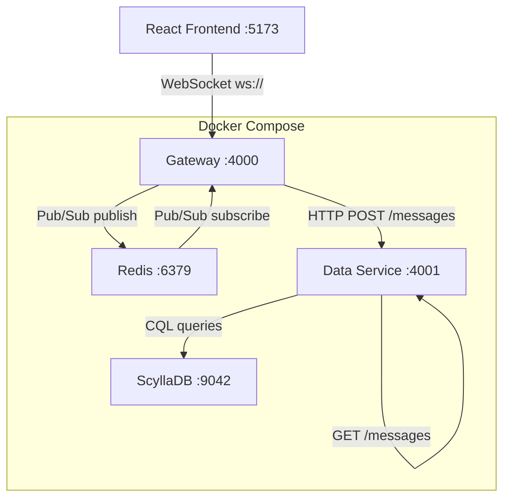

# PRD: Jiscord — Local Discord Clone (Text Channels MVP)

## Overview

Build a local-first Discord clone (text channels only) as a TypeScript monorepo orchestrated with Docker Compose. The system comprises four services: a WebSocket **Gateway** (Node.js), a **Data Service** (ScyllaDB queries + Dataloader), **ScyllaDB** for message persistence, and **Redis** for Pub/Sub event distribution. A React + TypeScript frontend connects to the Gateway via WebSocket. User identity is token-based (token = user) for MVP; auth is deferred.

## Architecture Dependency Graph

## Goals

- All four services start and pass health checks via `docker compose up`
- Gateway distributes messages via Redis Pub/Sub to support multiple instances
- Data Service uses Query-First ScyllaDB schema with Dataloader request coalescing
- No business logic ships in any service until its health check passes
- React frontend enables real-time text messaging across two browser tabs
- TypeScript strict mode with zero type errors across all packages

## Quality Gates

These commands must pass for every user story:
- `pnpm typecheck` — TypeScript type checking across all workspace packages
- `pnpm lint` — ESLint across all workspace packages

---

## User Stories

---

### Epic 1: Infrastructure

---

### US-001: Scaffold monorepo with pnpm workspaces
As a developer, I want a monorepo with pnpm workspaces so that all services share tooling and can be built and tested together.

**Acceptance Criteria:**
- [ ] Root `package.json` defines `workspaces: ["packages/*", "apps/*"]`
- [ ] `pnpm-workspace.yaml` lists `packages/*` and `apps/*`
- [ ] `packages/gateway/`, `packages/data-service/`, `packages/shared-types/` directories created with `package.json` in each
- [ ] `apps/web/` directory created with `package.json`
- [ ] Root `tsconfig.base.json` with `strict: true`, `moduleResolution: bundler`, and path aliases for workspace packages
- [ ] Each package has a `tsconfig.json` extending `../../tsconfig.base.json`
- [ ] Root `package.json` has scripts: `"typecheck": "pnpm -r typecheck"`, `"lint": "pnpm -r lint"`
- [ ] `pnpm install` from root resolves all workspace dependencies without errors

---

### US-002: Docker Compose orchestration
As a developer, I want a Docker Compose file that starts all services so that I can run the full stack locally with one command.

**Acceptance Criteria:**
- [ ] `docker-compose.yml` at repo root defines services: `scylladb`, `redis`, `gateway`, `data-service`
- [ ] ScyllaDB uses image `scylladb/scylla:5.4`, exposed on host port `9042`, with a named volume `scylla-data`
- [ ] Redis uses image `redis:7-alpine`, exposed on host port `6379`
- [ ] `gateway` service exposed on host port `4000`, reads env vars `REDIS_URL`, `DATA_SERVICE_URL`
- [ ] `data-service` service exposed on host port `4001`, reads env vars `SCYLLA_CONTACT_POINTS`, `SCYLLA_KEYSPACE`
- [ ] `docker-compose.dev.yml` override mounts `./packages/gateway/src` and `./packages/data-service/src` for hot-reload
- [ ] `.env.example` documents all required environment variables
- [ ] `docker compose up` starts all four services without errors (health check ordering handled in US-003/004)

---

### US-003: ScyllaDB container health check
As a developer, I want to confirm ScyllaDB is ready before any schema or query work begins so that setup scripts do not run against an unready database.

**Acceptance Criteria:**
- [ ] Docker Compose `healthcheck` for `scylladb` service uses: `cqlsh -e "describe cluster"`
- [ ] `interval: 10s`, `timeout: 5s`, `retries: 10` configured on the health check
- [ ] `scripts/wait-for-scylla.sh` polls `docker compose ps scylladb` until status is `healthy`
- [ ] `data-service` Docker Compose service has `depends_on: scylladb: condition: service_healthy`
- [ ] Running `docker compose up` and then `docker compose ps` shows `scylladb` as `healthy` within 90 seconds
- [ ] README documents: `docker compose ps` to verify health status

---

### US-004: Redis container health check
As a developer, I want to confirm Redis is ready before the Gateway attempts to connect so that the Gateway does not crash on startup.

**Acceptance Criteria:**
- [ ] Docker Compose `healthcheck` for `redis` service uses: `redis-cli ping`
- [ ] `interval: 5s`, `timeout: 3s`, `retries: 5` configured
- [ ] `gateway` Docker Compose service has `depends_on: redis: condition: service_healthy`
- [ ] `docker compose ps` shows `redis` as `healthy` within 15 seconds
- [ ] README documents the verification step

---

### Epic 2: Data Layer

---

### US-005: Define ScyllaDB access patterns (Query-First modeling)
As a developer, I want documented access patterns before writing any schema so that every table design is justified by a concrete query need.

**Acceptance Criteria:**
- [ ] `docs/data-access-patterns.md` created and committed
- [ ] Document lists all required access patterns, each with: pattern ID, description, query type (read/write), partition key, clustering key, expected cardinality
- [ ] Minimum access patterns documented:
  - AP-1: Write a message to a channel
  - AP-2: Read messages by channel, newest-first, paginated (50/page)
  - AP-3: Read a single message by ID
  - AP-4: List channels in a server
  - AP-5: Read a single channel by ID
- [ ] Document notes that AP-2 drives the `messages_by_channel` table design
- [ ] No schema files created until this document exists

---

### US-006: Define ScyllaDB keyspace and table schemas
As a developer, I want ScyllaDB schemas that satisfy all access patterns so that every query is efficient and avoids full-table scans.

**Acceptance Criteria:**
- [ ] `packages/data-service/src/schema/001_initial.cql` created with:
  - `CREATE KEYSPACE IF NOT EXISTS jiscord WITH replication = {'class': 'NetworkTopologyStrategy', 'replication_factor': 1}`
  - `messages_by_channel` table: partition key `channel_id (uuid)`, clustering key `message_id (timeuuid) DESC`, columns `user_token text`, `content text`
  - `channels` table: partition key `server_id (uuid)`, clustering key `channel_id (uuid)`, column `name text`, `created_at timestamp`
  - `servers` table: partition key `server_id (uuid)`, columns `name text`, `created_at timestamp`
- [ ] CQL comments explain each design decision and reference the access pattern it satisfies
- [ ] `scripts/apply-schema.sh` runs `cqlsh` against `localhost:9042` to apply the CQL file
- [ ] Running `scripts/apply-schema.sh` against a healthy ScyllaDB instance succeeds with no errors
- [ ] Each table maps to at least one access pattern from US-005

---

### US-007: Generate TypeScript interfaces from ScyllaDB schema
As a developer, I want TypeScript interfaces that mirror the ScyllaDB schema so that the type system enforces data shape across all services.

**Acceptance Criteria:**
- [ ] `packages/shared-types/src/db.ts` defines and exports:
  - `interface MessageRow { channel_id: string; message_id: string; user_token: string; content: string; created_at: Date }`
  - `interface ChannelRow { server_id: string; channel_id: string; name: string; created_at: Date }`
  - `interface ServerRow { server_id: string; name: string; created_at: Date }`
- [ ] All interfaces re-exported from `packages/shared-types/src/index.ts`
- [ ] `packages/gateway` and `packages/data-service` each declare `"@jiscord/shared-types": "workspace:*"` in `package.json`
- [ ] Zero `any` types in `shared-types` package
- [ ] `pnpm --filter @jiscord/shared-types typecheck` passes

---

### US-008: Data Service scaffold and health endpoint
As a developer, I want the Data Service to start and return HTTP 200 on `/health` before any ScyllaDB logic exists so that I can verify the service is running before wiring up the database.

**Acceptance Criteria:**
- [ ] `packages/data-service/src/index.ts` starts an Express server on port `4001` (from `PORT` env var, default `4001`)
- [ ] `GET /health` returns `{ "status": "ok", "service": "data-service" }` with HTTP 200
- [ ] Health endpoint does not require a database connection to return 200
- [ ] `docker compose up data-service` followed by `curl localhost:4001/health` returns HTTP 200
- [ ] Service startup logs: `Data Service listening on :4001`

---

### US-009: Data Service ScyllaDB connection
As a developer, I want the Data Service to establish a pooled ScyllaDB connection on startup so that query handlers can use it without reconnecting per request.

**Acceptance Criteria:**
- [ ] `packages/data-service/src/db/client.ts` exports a singleton `cassandra-driver` `Client` instance
- [ ] Connection config reads from env vars: `SCYLLA_CONTACT_POINTS` (comma-separated), `SCYLLA_KEYSPACE`
- [ ] Client calls `client.connect()` during service startup and logs `ScyllaDB connected` on success
- [ ] Service exits with code 1 if connection fails after 3 retries (5s between retries)
- [ ] `GET /health` response includes `"db": "connected"` when ScyllaDB client is connected, `"db": "disconnected"` otherwise
- [ ] Connection is established using the `jiscord` keyspace defined in US-006

---

### US-010: Data Service Dataloader for message batch loading
As a developer, I want a Dataloader for channel message queries so that concurrent requests for the same channel are coalesced into a single ScyllaDB read within an event-loop tick.

**Acceptance Criteria:**
- [ ] `dataloader` npm package installed in `data-service`
- [ ] `packages/data-service/src/loaders/messageLoader.ts` implements a `DataLoader<string, MessageRow[]>` keyed by `channel_id`
- [ ] Batch function issues one ScyllaDB query per unique `channel_id` in a batch (not one per key)
- [ ] Loader cache is per-request (created fresh per Express request, not module-level singleton) to avoid stale data
- [ ] Unit test in `packages/data-service/src/loaders/__tests__/messageLoader.test.ts`:
  - Two concurrent `loader.load(same_channel_id)` calls result in exactly one ScyllaDB query executed
- [ ] All message-read handlers in the Data Service use this loader; no direct ScyllaDB queries for message reads outside the loader

---

### US-011: Data Service message write endpoint
As a developer, I want a `POST /messages` endpoint so that the Gateway can persist messages to ScyllaDB.

**Acceptance Criteria:**
- [ ] `POST /messages` accepts JSON body: `{ channel_id: string, user_token: string, content: string }`
- [ ] Generates a TimeUUID for `message_id` using `cassandra-driver`'s `TimeUuid.now()`
- [ ] Inserts row into `messages_by_channel` table
- [ ] Returns HTTP 201 with body: `{ message_id, channel_id, user_token, content, created_at }`
- [ ] Returns HTTP 400 with `{ error: "missing required fields" }` if any field is absent
- [ ] Integration test: `POST /messages` → `GET /messages?channel_id=<id>` → message appears in response

---

### US-012: Data Service message read endpoint (paginated)
As a developer, I want a `GET /messages` endpoint with cursor-based pagination so that the frontend can load message history without full-table scans.

**Acceptance Criteria:**
- [ ] `GET /messages?channel_id=<id>&limit=<n>&cursor=<timeuuid>` supported
- [ ] `limit` defaults to `50`, maximum is `200`
- [ ] Results ordered newest-first (matching `messages_by_channel` clustering key order)
- [ ] Response body: `{ messages: MessageRow[], next_cursor: string | null }` — `next_cursor` is `null` when no more pages
- [ ] Uses Dataloader from US-010 for all reads (coalescing)
- [ ] Returns HTTP 400 if `channel_id` query param is missing
- [ ] Returns HTTP 200 with `messages: []` if channel has no messages

---

### US-013: Data Service channel endpoints
As a developer, I want endpoints to create and list channels so that the frontend can display navigation and the seed script can create initial channels.

**Acceptance Criteria:**
- [ ] `POST /channels` accepts `{ server_id: string, name: string }`, returns created `ChannelRow` with HTTP 201; channel ID generated server-side as UUID
- [ ] `GET /channels?server_id=<id>` returns `{ channels: ChannelRow[] }` for the given server; returns HTTP 400 if `server_id` missing
- [ ] `GET /channels/:channel_id` returns a single `ChannelRow` or HTTP 404 if not found
- [ ] `POST /servers` accepts `{ name: string }`, returns created `ServerRow` with HTTP 201 (needed for seed script)
- [ ] Integration tests cover create channel, list channels, get channel by ID, and 404 case

---

### Epic 3: Identity

---

### US-014: Token-based user identity middleware
As a developer, I want a token parsing middleware so that each WebSocket connection is associated with a user identity without a full auth system.

**Acceptance Criteria:**
- [ ] `packages/shared-types/src/identity.ts` defines and exports: `interface UserIdentity { user_token: string; username: string }`
- [ ] Token format is `<username>:<uuidv4>` — e.g., `alice:f47ac10b-58cc-4372-a567-0e02b2c3d479`
- [ ] `packages/gateway/src/middleware/tokenAuth.ts` exports `parseToken(raw: string): UserIdentity | null`
- [ ] Token parsed from WS upgrade request: `Authorization: Bearer <token>` header OR `?token=<token>` query param
- [ ] If no token found, WebSocket connection is rejected with close code `4001` and message `"missing token"`
- [ ] If token is malformed (does not match `<string>:<uuid>` pattern), connection rejected with code `4001` and message `"invalid token format"`
- [ ] Unit tests cover: valid token, missing token, malformed token (no colon, no UUID)
- [ ] No database lookup — token IS the identity

---

### Epic 4: Gateway Service

---

### US-015: Gateway service scaffold and health endpoint
As a developer, I want the Gateway to start and return HTTP 200 on `/health` before WebSocket or Redis logic exists so that I can verify the service before wiring dependencies.

**Acceptance Criteria:**
- [ ] `packages/gateway/src/index.ts` starts an HTTP server on port `4000` (from `PORT` env var, default `4000`)
- [ ] `GET /health` returns `{ "status": "ok", "service": "gateway" }` with HTTP 200
- [ ] `docker compose up gateway` → `curl localhost:4000/health` returns HTTP 200
- [ ] Service startup logs: `Gateway listening on :4000`

---

### US-016: Gateway Redis Pub/Sub connection
As a developer, I want the Gateway to connect two `ioredis` clients (publisher + subscriber) so that it can broadcast and receive channel messages via Redis Pub/Sub.

**Acceptance Criteria:**
- [ ] `ioredis` installed in `packages/gateway`
- [ ] `packages/gateway/src/redis/pubsub.ts` exports `publisher: Redis` and `subscriber: Redis` — two separate client instances (required by ioredis: a subscribed client cannot publish)
- [ ] Both clients read connection from `REDIS_URL` env var
- [ ] Both clients log `Redis publisher connected` / `Redis subscriber connected` on ready
- [ ] Service exits with code 1 if either client fails to connect
- [ ] `GET /health` response includes `"redis": "connected"` when both clients are ready

---

### US-017: Gateway WebSocket server
As a developer, I want the Gateway to accept WebSocket connections and track connected clients so that it can route messages to the right sockets.

**Acceptance Criteria:**
- [ ] `ws` npm package installed in `packages/gateway`
- [ ] `WebSocketServer` attached to the existing HTTP server (same port 4000, no second port)
- [ ] Token middleware from US-014 applied during WS upgrade — invalid tokens rejected before connection opens
- [ ] In-memory `Map<string, WebSocket>` tracks connected clients keyed by `user_token`
- [ ] New connection logged: `WS connected: <username>`
- [ ] Disconnection removes client from map and logs: `WS disconnected: <username>`
- [ ] Unit test: client connects → appears in map; client disconnects → removed from map

---

### US-018: Gateway WebSocket event envelope
As a developer, I want all WebSocket messages to use a typed discriminated union so that both the Gateway and frontend handle events predictably.

**Acceptance Criteria:**
- [ ] `packages/shared-types/src/events.ts` defines and exports:
  - `type ClientEvent = SubscribeEvent | UnsubscribeEvent | SendMessageEvent`
  - `interface SubscribeEvent { type: "subscribe"; channel_id: string }`
  - `interface UnsubscribeEvent { type: "unsubscribe"; channel_id: string }`
  - `interface SendMessageEvent { type: "message"; channel_id: string; content: string }`
  - `type ServerEvent = IncomingMessageEvent | ErrorEvent | AckEvent`
  - `interface IncomingMessageEvent { type: "message"; message_id: string; channel_id: string; username: string; content: string; created_at: string }`
  - `interface ErrorEvent { type: "error"; message: string }`
  - `interface AckEvent { type: "ack"; message_id: string }`
- [ ] All types exported from `shared-types` index
- [ ] Gateway uses `ClientEvent` for parsing inbound WS messages and `ServerEvent` for outbound
- [ ] Malformed inbound message (parse error or unknown `type`) causes Gateway to send `ErrorEvent` — no uncaught exception

---

### US-019: Gateway channel subscription
As a developer, I want clients to subscribe and unsubscribe to channels over WebSocket so that the Gateway only fan-outs messages to relevant clients.

**Acceptance Criteria:**
- [ ] Gateway handles `SubscribeEvent`: adds `channel_id` to an in-memory `Map<user_token, Set<channel_id>>`
- [ ] Gateway handles `UnsubscribeEvent`: removes `channel_id` from the set
- [ ] When the first client subscribes to a channel, Gateway calls `subscriber.subscribe("channel:<channel_id>")`
- [ ] When the last client unsubscribes from a channel, Gateway calls `subscriber.unsubscribe("channel:<channel_id>")`
- [ ] Duplicate `subscribe` for same channel is idempotent (no error, no duplicate Redis subscription)
- [ ] On client disconnect, all of that client's channel subscriptions are cleaned up
- [ ] Unit tests for subscribe/unsubscribe state transitions including last-client-leaves cleanup

---

### US-020: Gateway message send and broadcast
As a developer, I want clients to send messages that are persisted and broadcast to all channel subscribers so that real-time messaging works end-to-end.

**Acceptance Criteria:**
- [ ] Gateway handles `SendMessageEvent`: calls Data Service `POST /messages` with `{ channel_id, user_token, content }`
- [ ] On successful persist, Gateway publishes the full `IncomingMessageEvent` payload to Redis key `channel:<channel_id>` via `publisher.publish(...)`
- [ ] `subscriber.on("message", ...)` handler deserializes the Redis payload and sends `IncomingMessageEvent` to all WebSocket clients subscribed to that channel
- [ ] The sending client receives the message back (included in the fan-out)
- [ ] On Data Service HTTP failure, Gateway sends `ErrorEvent { type: "error", message: "failed to persist message" }` to sender only
- [ ] Integration test: two WS clients both subscribe to the same channel → client A sends message → both A and B receive `IncomingMessageEvent`

---

### Epic 5: Frontend (React)

---

### US-021: React app scaffold with WebSocket hook
As a developer, I want a Vite + React + TypeScript app with a typed WebSocket hook so that UI components can connect to the Gateway without duplicating connection logic.

**Acceptance Criteria:**
- [ ] `apps/web` scaffold created with Vite (`pnpm create vite`) using `react-ts` template
- [ ] `@jiscord/shared-types` added as workspace dependency
- [ ] `apps/web/src/hooks/useGateway.ts` exports `useGateway({ token, gatewayUrl })` returning `{ send, lastMessage, readyState }`
- [ ] `lastMessage` is typed as `ServerEvent | null`
- [ ] `send` accepts `ClientEvent` and serializes to JSON before sending
- [ ] Hook auto-reconnects on disconnect with exponential backoff (100ms base, max 5 attempts)
- [ ] `VITE_GATEWAY_URL` env var sets gateway URL (default `ws://localhost:4000`)
- [ ] `apps/web/.env.example` documents `VITE_GATEWAY_URL` and `VITE_DATA_SERVICE_URL`

---

### US-022: Token input and identity setup
As a user, I want to enter a token on first load so that the app knows who I am before connecting to the Gateway.

**Acceptance Criteria:**
- [ ] On app load: if no token in `localStorage.getItem("jiscord_token")`, render `<TokenInput />` screen
- [ ] `TokenInput` shows a text field and "Connect" button
- [ ] Validates token matches `/^[a-zA-Z0-9_-]+:[0-9a-f-]{36}$/` before accepting
- [ ] Invalid format shows inline error: `"Token must be in format username:uuid"`
- [ ] Valid token saved to `localStorage` and app transitions to main layout
- [ ] Main layout shows a "Change identity" link that clears the token and returns to `TokenInput`
- [ ] Token is passed to `useGateway` hook on main layout mount

---

### US-023: Channel list sidebar
As a user, I want to see a list of text channels in a sidebar so that I can navigate between them.

**Acceptance Criteria:**
- [ ] `ChannelList` component fetches `GET /channels?server_id=<id>` from Data Service on mount
- [ ] Uses a hardcoded default `server_id` (from `VITE_DEFAULT_SERVER_ID` env var) for MVP
- [ ] Channels rendered as a vertical list in a left sidebar; each item shows channel name prefixed with `#`
- [ ] Clicking a channel: sets selected channel state, sends `SubscribeEvent` to Gateway, sends `UnsubscribeEvent` for previously selected channel
- [ ] Selected channel is visually highlighted
- [ ] Loading state shows a spinner; error state shows `"Failed to load channels"`
- [ ] `VITE_DATA_SERVICE_URL` env var configures Data Service base URL (default `http://localhost:4001`)

---

### US-024: Message list with real-time updates
As a user, I want to see message history and receive new messages in real-time so that I can follow the conversation.

**Acceptance Criteria:**
- [ ] `MessageList` component: on channel select, fetches `GET /messages?channel_id=<id>&limit=50` from Data Service
- [ ] Message history rendered newest-at-bottom (reverse the newest-first API response)
- [ ] Each message shows: `username` (parsed from `user_token` before `:`), message content, formatted timestamp (`HH:mm` or relative)
- [ ] New `IncomingMessageEvent` from `useGateway`'s `lastMessage` is appended to the message list in real-time without refetching
- [ ] List auto-scrolls to the bottom when a new message arrives
- [ ] "Load more" button at top fetches next page using `cursor` from previous response; prepends messages to list
- [ ] Loading state shown while fetching history

---

### US-025: Message input and end-to-end verification
As a user, I want to type and send a message so that I can participate in a channel conversation.

**Acceptance Criteria:**
- [ ] `MessageInput` component renders a `<textarea>` and "Send" button pinned to the bottom of the channel view
- [ ] Pressing Enter (without Shift) submits the message; Shift+Enter inserts a newline
- [ ] On submit: calls `send(SendMessageEvent)` via `useGateway`, clears the input, returns focus to textarea
- [ ] Empty or whitespace-only messages are not submitted
- [ ] If `readyState !== WebSocket.OPEN`, button is disabled and shows tooltip: `"Reconnecting..."`
- [ ] End-to-end smoke test (manual): open two browser tabs with different tokens → both subscribe to `#general` → send message in tab A → message appears in both tabs within 500ms

---

## Functional Requirements

- FR-1: Every service must expose a `/health` endpoint returning HTTP 200 before any business logic is enabled
- FR-2: ScyllaDB schema must be derived from documented access patterns; schema files must not predate `docs/data-access-patterns.md`
- FR-3: The Data Service must use Dataloader (request coalescing) for all message-read operations; no direct ScyllaDB reads for messages outside the loader
- FR-4: The Gateway must use two separate `ioredis` clients — one for publishing, one for subscribing
- FR-5: User identity is a `<username>:<uuidv4>` token string; no auth service, session store, or database lookup required for MVP
- FR-6: All WebSocket messages (client→server and server→client) must conform to the typed `ClientEvent` / `ServerEvent` discriminated unions from `shared-types`
- FR-7: The Gateway must fan out messages via Redis Pub/Sub so that a second Gateway instance would also receive and forward messages
- FR-8: Message IDs must be TimeUUIDs to enable time-ordered clustering in ScyllaDB
- FR-9: All services must read configuration exclusively from environment variables — no hardcoded hostnames, ports, or credentials
- FR-10: Docker Compose `depends_on` with `condition: service_healthy` must enforce startup ordering: ScyllaDB → Data Service, Redis → Gateway

## Non-Goals

- Voice or video channels (deferred entirely)
- OAuth2, session-based auth, or JWT (auth deferred; revisit after MVP)
- Message editing, deletion, or reactions
- Threads, embeds, or rich media attachments
- File/image uploads
- User presence indicators (online/offline status)
- Server or channel management UI (channels seeded via `POST /channels` script for MVP)
- Direct messages between users
- Search or message indexing
- Rate limiting or abuse prevention
- Production deployment or horizontal scaling configuration
- Push notifications

## Technical Considerations

- Use `cassandra-driver` npm package for ScyllaDB — it is Cassandra-compatible and supports TimeUUID natively
- Use `ioredis` for Redis client (not `redis` npm package); two separate instances required for Pub/Sub
- TimeUUID generation: prefer `cassandra-driver`'s `types.TimeUuid.now()` for consistency with the driver
- Dataloader: use the `dataloader` npm package; instantiate per-request to prevent cross-request cache pollution
- Vite dev server proxy (`vite.config.ts`) can forward `/api/*` to the Data Service to avoid CORS in development
- Docker Compose `healthcheck` + `condition: service_healthy` in `depends_on` is the correct mechanism for startup ordering
- `scripts/seed.sh` (suggested): creates a default server and `#general` channel on first boot using the Data Service REST API

## Success Metrics

- `docker compose up` starts all four services; all health checks show `healthy` within 90 seconds
- Two browser tabs with different tokens can exchange messages in real-time with observed latency under 500ms on localhost
- Message history persists across Gateway restarts (ScyllaDB is the durable store)
- `pnpm typecheck && pnpm lint` pass across all workspace packages with zero errors or warnings

## Open Questions

- Should a `scripts/seed.sh` automatically create a default server and `#general` channel on first boot? (Assumed yes for MVP usability)
- Should the Data Service expose REST or gRPC to the Gateway? (REST assumed for MVP simplicity)
- When revisiting auth: JWT with a `users` table in ScyllaDB, or a separate identity service?
- Should the Gateway validate that a `channel_id` exists (via Data Service) before accepting a subscribe event, or trust the client for MVP?