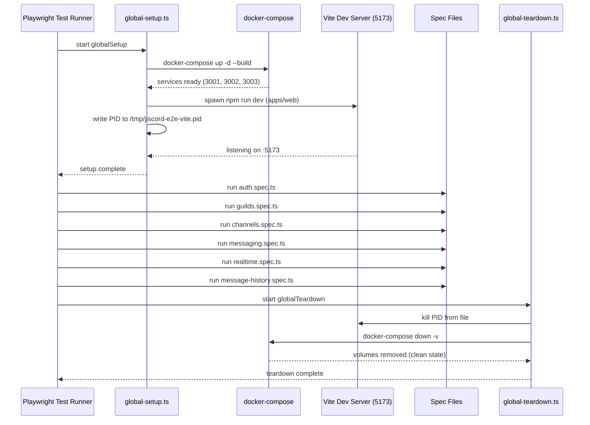

# Jiscord E2E Test Suite

Playwright end-to-end tests for the full Jiscord stack.

## Prerequisites

- [Docker](https://docs.docker.com/get-docker/) (for ScyllaDB, Redis, and backend services)
- Node.js ≥ 18 and npm

## Running the Tests

```bash
cd tests/e2e
npm install
npx playwright install chromium   # first run only
npm test
```

The test suite **automatically**:
1. Runs `docker-compose up -d --build` from the project root
2. Waits for all backend services to be healthy
3. Starts the Vite dev server (`apps/web`)
4. Executes all spec files
5. Kills Vite and runs `docker-compose down -v` (removes volumes for a clean slate)

Running `npm test` a second time always starts from a clean state.

## What Each Spec Covers

| File | Scenarios |
|---|---|
| `tests/auth.spec.ts` | Registration (success, duplicate email, short username/password), Login (correct/wrong creds, nonexistent user), Protected routes (redirect, logout) |
| `tests/guilds.spec.ts` | Create guild (panel, icon in sidebar), Browse guilds (list, joined badge), Join guild (guild appears in sidebar) |
| `tests/channels.spec.ts` | Create channel (+, Enter, # prefix), List channels (guild selection loads channels, active highlighting) |
| `tests/messaging.spec.ts` | Send via UI (Enter sends, textarea clears, Shift+Enter newline), Display (author/timestamp), API assertions |
| `tests/realtime.spec.ts` | Two-client MESSAGE_CREATE delivery, Single-session enforcement (INVALID_SESSION), Typing indicators |
| `tests/message-history.spec.ts` | Load history (empty placeholder, 50-msg limit), Cursor pagination (Load More, 55 msgs), API cursor test |

## Design Decisions

### Single Worker (`workers: 1`)
All tests run serially in one worker. This is intentional:
- The gateway enforces **one session per user** — parallel tests using the same user would evict each other.
- ScyllaDB and the Redis pub/sub layer are shared; sequential execution avoids race conditions.
- Each test seeds its own unique guilds/channels/users, so there is no test pollution.

### PID File for Vite Teardown
Playwright's `globalSetup` and `globalTeardown` run in **separate Node.js processes**. Using a `/tmp/jiscord-e2e-vite.pid` file is the simplest way to pass the Vite process ID between them without shared memory.

### Channel Subscription via `SEND_MESSAGE`
The gateway only delivers `MESSAGE_CREATE` events to clients that are subscribed to a channel. Subscription is implicit — it happens automatically when a client sends `SEND_MESSAGE` or `TYPING_START` to a channel. In real-time tests where a `GatewayClient` needs to receive events, it must first send a probe message to subscribe.

## Architecture Diagram


